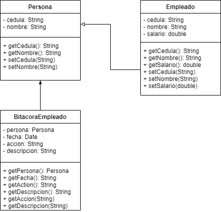

# Proyecto
Utilizado los temas vistos en Clase, haga una pequeña aplicación que resuelva alguna necesidad personal que tenga las siguientes características

##Caracteristicas
* Debe tener al menos 1 Clase Abstracta
* Debe tener al menos 1 Interfaz
* La aplicación debe correr(Usando un IDE) y recibir información del Usuario Final.
* Se debe validar la integridad de los datos.
* Abstraer la lógica de negocio en una clase Service
* Abstraer la lógica de almacenamiento en una clase repository
* Manejar las excepciones.
* Procurar las buenas prácticas que hemos visto en clase en cuanto a legibilidad, reusabilidad, KISS, YAGNI, etc.
* El trabajo será entregado por este medio (Google Classroom) enviando el enlace al nuevo repositorio creado.

###GitHub Repository
* Debe estar alojado en un repositorio de GitHub nuevo llamado "Proyecto"
* Este nuevo repositorio de Git tendrá un nuevo Proyecto en Java llamado igual que el repositorio (Proyecto)
* URL: https://github.com/Tattiana-alfaro/Proyecto

###UML
* Debe tener al menos 3 Entidades de Dominio.
* Debe crear un diagrama UML que explique cómo estas entidades se relacionan.
  
